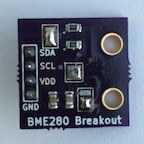
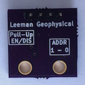
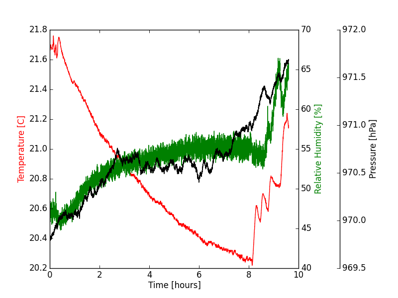

# BME280 Breakout

## Purpose

Breakout board for the Bosch BME280 sensor. Selectable address and optional
pull-up resistors. This looks like a great little sensor and we wanted to
try it out!

## Purchasing

The dual channel instrumentation amplifier is available through Leeman
Geophysical by emailing [John R. Leeman](http://www.johnrleeman.com) at
<kd5wxb@gmail.com>.

## Project Information

This repository includes all design information, CAD files, PDF CAD output,
gerbers, etc.

Additional resources for this project include:

- [BME280 Datasheet](PDFs/bme280.pdf)
- [Bosch Drive Code Repo (from Bosch)](https://github.com/BoschSensortec/BME280_driver)
- [Example Arduino Code (from Embedded Adventures)](https://github.com/embeddedadventures/BME280)

## License

This product is licensed under the CERN Open Hardware License 1.2. The [full
license](cern_ohl_v_1_2.txt) is included in this repository.

## Hookup Guide

Connect the sensor to a 3.3 VDC supply and ground. Connect to the I2C bus of
your micro-controller or system. Note that this unit is NOT 5 VDC tolerant!
If you are using 5 VDC logic, please use a [level shifter](https://www.sparkfun.com/products/12009?gclid=CJTokbvrusUCFegF7AodUhAAqw) to prevent damage.

## Example Data

